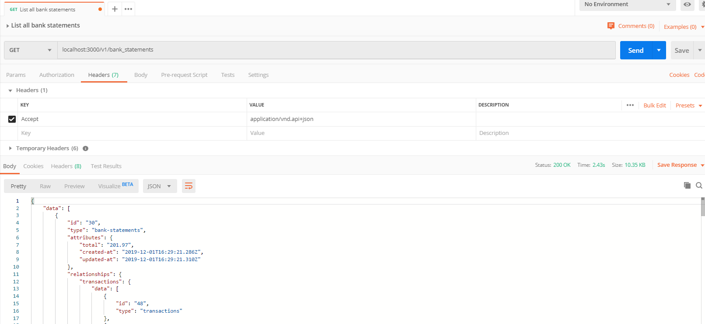
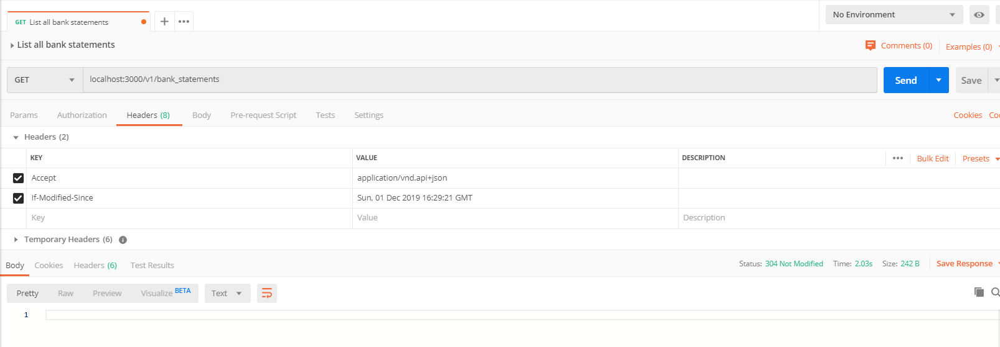

# Bank Statement API routes documentation

## Authentication

To create a user in the API, you must access the route:

`POST /auth` - 

**Headers**
 `Accept: application/vnd.api+json`
 `Content-type: application/vnd.api+json`

In the request body, it is necessary to pass three parameters: **email**, **password**, and **password_confirmation**. The request is made according to the example below.

`{"email": "mariana@bsi.ufla.br", "password": "12345678", "password_confirmation": "12345678"}`

The response should be as the example below:

```
{
    "status": "success",
    "data": {
        "uid": "mariana@bsi.ufla.br",
        "id": 1,
        "email": "mariana@bsi.ufla.br",
        "provider": "email",
        "allow_password_change": false,
        "name": null,
        "nickname": null,
        "image": null,
        "created_at": "2019-11-26T02:03:28.026Z",
        "updated_at": "2019-11-26T02:03:28.467Z",
        "type": "user"
    }
}
```

`POST /auth/sign_in` - login in the API

**Headers**
 -**Accept**: `application/vnd.api+json`
 -**Content-type**: `application/vnd.api+json`

In the request body, it is necessary to pass three parameters: **email** and **password**. The request is made according to the example below.

`{"email": "mariana@bsi.ufla.br", "password": "12345678"}`

The response should be as the example below:

```
{
    "data": {
        "id": 1,
        "email": "mariana@bsi.ufla.br",
        "provider": "email",
        "uid": "mariana@bsi.ufla.br",
        "name": null,
        "nickname": null,
        "image": null,
        "type": "user"
    }
}
```

## Bank Statements operations

`GET /bank_statements` - returns all bank statements in the database

`GET host/v1/bank_statements` - all bank statements without cache

**Headers**
    - **Accept**: `application/vnd.api+json`

**Response**

Status: 200 (OK)

```
{
    "data": [
        {
            "id": "30",
            "type": "bank-statements",
            "attributes": {
                "total": "201.97",
                "created-at": "2019-12-01T16:29:21.286Z",
                "updated-at": "2019-12-01T16:29:21.310Z"
            },
            "relationships": {
                "transactions": {
                    "data": [
                        {
                            "id": "48",
                            "type": "transactions"
                        },
                        {
                            "id": "49",
                            "type": "transactions"
                        },
                        {
                            "id": "50",
                            "type": "transactions"
                        }
                    ],
                    "links": {
                        "related": "http://localhost:3000/v1/bank_statements/30/transactions"
                    }
                }
            },
            "links": {
                "self": "http://localhost:3000/v1/bank_statements/30"
            }
        },
        {
            "id": "1",
            "type": "bank-statements",
            "attributes": {
                "total": "265.16",
                "created-at": "2019-12-01T16:29:12.403Z",
                "updated-at": "2019-12-01T16:29:20.808Z"
            },
            "relationships": {
                "transactions": {
                    "data": [
                        {
                            "id": "1",
                            "type": "transactions"
                        },
                        {
                            "id": "2",
                            "type": "transactions"
                        },
                        {
                            "id": "3",
                            "type": "transactions"
                        },
                        {
                            "id": "4",
                            "type": "transactions"
                        }
                    ],
                    "links": {
                        "related": "http://localhost:3000/v1/bank_statements/1/transactions"
                    }
                }
            },
            "links": {
                "self": "http://localhost:3000/v1/bank_statements/1"
            }
        },
        {
            "id": "32",
            "type": "bank-statements",
            "attributes": {
                "total": "82.64",
                "created-at": "2019-12-01T16:29:21.314Z",
                "updated-at": "2019-12-01T16:29:21.322Z"
            },
            "relationships": {
                "transactions": {
                    "data": [
                        {
                            "id": "51",
                            "type": "transactions"
                        }
                    ],
                    "links": {
                        "related": "http://localhost:3000/v1/bank_statements/32/transactions"
                    }
                }
            },
            "links": {
                "self": "http://localhost:3000/v1/bank_statements/32"
            }
        }
    ]
}
```



`GET host/v1/bank_statements` - all bank statements cached

**Headers**
    - **Accept**: `application/vnd.api+json`
    - **If-Modified-Since**: `Sun, 01 Dec 2019 16:29:21 GMT`

**Response**

Status: 304 (Not Modified)



`GET host/v1/bank_statements?numDays=3` - all bank statements created by a number of days ago

**Headers**
    - **Accept**: `application/vnd.api+json`

**Response**

Status: 200 (OK)

```
{
    "data": [
        {
            "id": "28",
            "type": "bank-statements",
            "attributes": {
                "total": "135.97",
                "created-at": "2019-11-28T16:29:21.286Z",
                "updated-at": "2019-12-28T16:29:21.310Z"
            },
            "relationships": {
                "transactions": {
                    "data": [
                        {
                            "id": "5",
                            "type": "transactions"
                        },
                        {
                            "id": "4",
                            "type": "transactions"
                        },
                        {
                            "id": "18",
                            "type": "transactions"
                        }
                    ],
                    "links": {
                        "related": "http://localhost:3000/v1/bank_statements/28/transactions"
                    }
                }
            },
            "links": {
                "self": "http://localhost:3000/v1/bank_statements/28"
            }
        },
        {
            "id": "31",
            "type": "bank-statements",
            "attributes": {
                "total": "500.16",
                "created-at": "2019-12-27T16:29:12.403Z",
                "updated-at": "2019-12-27T16:29:20.808Z"
            },
            "relationships": {
                "transactions": {
                    "data": [
                        {
                            "id": "21",
                            "type": "transactions"
                        },
                        {
                            "id": "22",
                            "type": "transactions"
                        }
                    ],
                    "links": {
                        "related": "http://localhost:3000/v1/bank_statements/31/transactions"
                    }
                }
            },
            "links": {
                "self": "http://localhost:3000/v1/bank_statements/31"
            }
        }
    ]
}
```

If is an empty list:

<code>
{
    "data": [],
    "links": {
        "self": "<http://localhost:3000/v1/bank_statements?numDays=3&page%5Bnumber%5D=1&page%5Bsize%5D=25,>"
        "first": "<http://localhost:3000/v1/bank_statements?numDays=3&page%5Bnumber%5D=1&page%5Bsize%5D=25,>"
        "prev": null,
        "next": null,
        "last": "<http://localhost:3000/v1/bank_statements?numDays=3&page%5Bnumber%5D=1&page%5Bsize%5D=25>"
    }
}
</code>

`GET host/v1/bank_statements?page%5Bnumber%5D=2` - all bank statements by a page

```
{
    "data": [
        {
            "id": "16",
            "type": "bank-statements",
            "attributes": {
                "total": "188.65",
                "created-at": "2019-12-01T16:29:21.007Z",
                "updated-at": "2019-12-01T16:29:21.025Z"
            },
            "relationships": {
                "transactions": {
                    "data": [
                        {
                            "id": "23",
                            "type": "transactions"
                        },
                        {
                            "id": "24",
                            "type": "transactions"
                        }
                    ],
                    "links": {
                        "related": "http://localhost:3000/v1/bank_statements/16/transactions"
                    }
                }
            },
            "links": {
                "self": "http://localhost:3000/v1/bank_statements/16"
            }
        },
        {
            "id": "17",
            "type": "bank-statements",
            "attributes": {
                "total": "0.0",
                "created-at": "2019-12-01T16:29:21.028Z",
                "updated-at": "2019-12-01T16:29:21.028Z"
            },
            "relationships": {
                "transactions": {
                    "data": [],
                    "links": {
                        "related": "http://localhost:3000/v1/bank_statements/17/transactions"
                    }
                }
            },
            "links": {
                "self": "http://localhost:3000/v1/bank_statements/17"
            }
        }
    ]
}
```

`POST v1/bank_statement/:id` - create a bank statement

**Headers**
    - **Accept**: `application/vnd.api+json`
    - **Content-type**: `application/vnd.api+json`

**Body**

```
{
    "data": {
        "type": "bank-statements",
        "attributes": {
            "total": "1000.00"
        }
    }
}
```

**Response**

Status: 201 (Created)

```
{
    "data": {
        "id": "56",
        "type": "bank-statements",
        "attributes": {
            "total": "1000.0",
            "created-at": "2019-12-01T21:58:33.551Z",
            "updated-at": "2019-12-01T21:58:33.551Z"
        },
        "relationships": {
            "transactions": {
                "data": [],
                "links": {
                    "related": "http://localhost:3000/v1/bank_statements/56/transactions"
                }
            }
        },
        "links": {
            "self": "http://localhost:3000/v1/bank_statements/56"
        }
    }
}
```

`PUT v1/bank_statement/:id` - update more than one attributes of a bank statement

**Headers**
    - **Accept**: `application/vnd.api+json`
    - **Content-type**: `application/vnd.api+json`

**Body**

```
{
	"data": {
        "id": "19",
        "type": "bank-statements",
        "attributes": {
            "total": "196.80",
            "created-at": "2019-12-01T16:29:21.033Z",
            "updated-at": "2019-12-01T21:50:48.259Z"
        },
        "relationships": {
            "transactions": {
                "data": [
                    {
                        "id": "25",
                        "type": "transactions"
                    },
                    {
                        "id": "26",
                        "type": "transactions"
                    },
                    {
                        "id": "27",
                        "type": "transactions"
                    }
                ],
                "links": {
                    "related": "http://localhost:3000/v1/bank_statements/19/transactions"
                }
            }
        },
        "links": {
            "self": "http://localhost:3000/v1/bank_statements/19"
        }
    }
}
```

**Response**

Status: 200 (OK)

```
{
    "data": {
        "id": "19",
        "type": "bank-statements",
        "attributes": {
            "total": "196.8",
            "created-at": "2019-12-01T16:29:21.033Z",
            "updated-at": "2019-12-01T21:50:48.259Z"
        },
        "relationships": {
            "transactions": {
                "data": [
                    {
                        "id": "25",
                        "type": "transactions"
                    },
                    {
                        "id": "26",
                        "type": "transactions"
                    },
                    {
                        "id": "27",
                        "type": "transactions"
                    }
                ],
                "links": {
                    "related": "http://localhost:3000/v1/bank_statements/19/transactions"
                }
            }
        },
        "links": {
            "self": "http://localhost:3000/v1/bank_statements/19"
        }
    },
    "included": [
        {
            "id": "25",
            "type": "transactions",
            "attributes": {
                "amount": "44.43",
                "credit-card": "4801-1159-6439-8373",
                "installments": 9,
                "created-at": "2019-12-01T16:29:21.035Z",
                "updated-at": "2019-12-01T16:29:21.038Z"
            },
            "relationships": {
                "bank-statement": {
                    "data": {
                        "id": "19",
                        "type": "bank-statements"
                    }
                }
            }
        },
        {
            "id": "26",
            "type": "transactions",
            "attributes": {
                "amount": "98.88",
                "credit-card": "4409-5472-1496-9304",
                "installments": 3,
                "created-at": "2019-12-01T16:29:21.044Z",
                "updated-at": "2019-12-01T16:29:21.047Z"
            },
            "relationships": {
                "bank-statement": {
                    "data": {
                        "id": "19",
                        "type": "bank-statements"
                    }
                }
            }
        },
        {
            "id": "27",
            "type": "transactions",
            "attributes": {
                "amount": "53.67",
                "credit-card": "4565136586219",
                "installments": 4,
                "created-at": "2019-12-01T16:29:21.053Z",
                "updated-at": "2019-12-01T16:29:21.055Z"
            },
            "relationships": {
                "bank-statement": {
                    "data": {
                        "id": "19",
                        "type": "bank-statements"
                    }
                }
            }
        }
    ]
}
```

`PATCH v1/bank_statement/:id` - update only one attributes of the bank statement

**Headers**
    - **Accept**: `application/vnd.api+json`
    - **Content-type**: `application/vnd.api+json`

**Body**

```
{
    "data": 
    {
    	"id": "19",
        "type": "transactions",
        "attributes": {
            "total": "197.00"
        }
    }
}
```

**Response**

Status: 200 (OK)

```
{
    "data": {
        "id": "19",
        "type": "bank-statements",
        "attributes": {
            "total": "197.0",
            "created-at": "2019-12-01T16:29:21.033Z",
            "updated-at": "2019-12-01T21:50:48.259Z"
        },
        "relationships": {
            "transactions": {
                "data": [
                    {
                        "id": "25",
                        "type": "transactions"
                    },
                    {
                        "id": "26",
                        "type": "transactions"
                    },
                    {
                        "id": "27",
                        "type": "transactions"
                    }
                ],
                "links": {
                    "related": "http://localhost:3000/v1/bank_statements/19/transactions"
                }
            }
        },
        "links": {
            "self": "http://localhost:3000/v1/bank_statements/19"
        }
    },
    "included": [
        {
            "id": "25",
            "type": "transactions",
            "attributes": {
                "amount": "44.43",
                "credit-card": "4801-1159-6439-8373",
                "installments": 9,
                "created-at": "2019-12-01T16:29:21.035Z",
                "updated-at": "2019-12-01T16:29:21.038Z"
            },
            "relationships": {
                "bank-statement": {
                    "data": {
                        "id": "19",
                        "type": "bank-statements"
                    }
                }
            }
        },
        {
            "id": "26",
            "type": "transactions",
            "attributes": {
                "amount": "98.88",
                "credit-card": "4409-5472-1496-9304",
                "installments": 3,
                "created-at": "2019-12-01T16:29:21.044Z",
                "updated-at": "2019-12-01T16:29:21.047Z"
            },
            "relationships": {
                "bank-statement": {
                    "data": {
                        "id": "19",
                        "type": "bank-statements"
                    }
                }
            }
        },
        {
            "id": "27",
            "type": "transactions",
            "attributes": {
                "amount": "53.67",
                "credit-card": "4565136586219",
                "installments": 4,
                "created-at": "2019-12-01T16:29:21.053Z",
                "updated-at": "2019-12-01T16:29:21.055Z"
            },
            "relationships": {
                "bank-statement": {
                    "data": {
                        "id": "19",
                        "type": "bank-statements"
                    }
                }
            }
        }
    ]
}
```

`DELETE v1/bank_statements/:id` - delete a bank statement

**Headers**
    - **Accept**: `application/vnd.api+json`
    - **Content-type**: `application/vnd.api+json`

**Response**

Status: 204 (No Content)

## Transactions operations

`GET v1/bank_statements/:id/transactions` - list all transactions by bank statement, using id as parameter

**Headers**
    - **Accept**: `application/vnd.api+json`

**Response**

Status: 200 (OK)

```
{
    "data": [
        {
            "id": "1",
            "type": "transactions",
            "attributes": {
                "amount": "63.37",
                "credit-card": "4550-8485-8307-1517",
                "installments": 9,
                "created-at": "2019-12-01T16:29:20.517Z",
                "updated-at": "2019-12-01T16:29:20.764Z"
            },
            "relationships": {
                "bank-statement": {
                    "data": {
                        "id": "1",
                        "type": "bank-statements"
                    }
                }
            }
        },
        {
            "id": "2",
            "type": "transactions",
            "attributes": {
                "amount": "99.11",
                "credit-card": "6771-8930-1276-1195",
                "installments": 4,
                "created-at": "2019-12-01T16:29:20.783Z",
                "updated-at": "2019-12-01T16:29:20.786Z"
            },
            "relationships": {
                "bank-statement": {
                    "data": {
                        "id": "1",
                        "type": "bank-statements"
                    }
                }
            }
        },
        {
            "id": "3",
            "type": "transactions",
            "attributes": {
                "amount": "43.34",
                "credit-card": "5197-4272-2291-8499",
                "installments": 6,
                "created-at": "2019-12-01T16:29:20.792Z",
                "updated-at": "2019-12-01T16:29:20.795Z"
            },
            "relationships": {
                "bank-statement": {
                    "data": {
                        "id": "1",
                        "type": "bank-statements"
                    }
                }
            }
        },
        {
            "id": "4",
            "type": "transactions",
            "attributes": {
                "amount": "59.34",
                "credit-card": "4101020023547",
                "installments": 8,
                "created-at": "2019-12-01T16:29:20.802Z",
                "updated-at": "2019-12-01T16:29:20.805Z"
            },
            "relationships": {
                "bank-statement": {
                    "data": {
                        "id": "1",
                        "type": "bank-statements"
                    }
                }
            }
        }
    ]
}
```

`POST v1/bank_statement/:id/transaction` - create a transaction in a bank statement

**Headers**
    - **Accept**: `application/vnd.api+json`
    - **Content-type**: `application/vnd.api+json`

**Body**

```
{
    "data": 
    {
        "type": "transactions",
        "attributes": {
            "amount": "326.99",
            "credit-card": "9874-1256-3201-4856",
            "installments": 3
        }
    }
}
```

**Response**

Status: 201 (Created)

```
{
    "data": [
        {
            "id": "93",
            "type": "transactions",
            "attributes": {
                "amount": "326.99",
                "credit-card": "9874-1256-3201-4856",
                "installments": 3,
                "created-at": "2019-12-01T21:16:24.779Z",
                "updated-at": "2019-12-01T21:16:24.779Z"
            },
            "relationships": {
                "bank-statement": {
                    "data": {
                        "id": "17",
                        "type": "bank-statements"
                    }
                }
            }
        }
    ]
}
```

`PUT v1/bank_statement/:id/transaction` - update more than one attributes of the transaction in a bank statement

**Headers**
    - **Accept**: `application/vnd.api+json`
    - **Content-type**: `application/vnd.api+json`

**Body**

```
{
    "data":
    {
        "id": "93",
        "type": "transactions",
        "attributes": {
            "amount": "400.00",
            "credit-card": "9874-1256-3201-4856",
            "installments": 4,
            "created-at": "2019-12-01T21:16:24.779Z",
            "updated-at": "2019-12-01T21:16:24.779Z"
        }
    }
}
```

**Response**

Status: 200 (OK)

```
{
    "data": [
        {
            "id": "93",
            "type": "transactions",
            "attributes": {
                "amount": "400.0",
                "credit-card": "9874-1256-3201-4856",
                "installments": 4,
                "created-at": "2019-12-01T21:16:24.779Z",
                "updated-at": "2019-12-01T21:16:24.779Z"
            },
            "relationships": {
                "bank-statement": {
                    "data": {
                        "id": "17",
                        "type": "bank-statements"
                    }
                }
            }
        }
    ]
}
```

`PATCH v1/bank_statement/:id/transaction` - update only one attributes of the transaction in a bank statement

**Headers**
    - **Accept**: `application/vnd.api+json`
    - **Content-type**: `application/vnd.api+json`

**Body**

```
{
    "data": 
    {
    	"id": "93",
        "type": "transactions",
        "attributes": {
            "amount": "440.00"
        }
    }
}
```

**Response**

Status: 200 (OK)

```
{
    "data": [
        {
            "id": "93",
            "type": "transactions",
            "attributes": {
                "amount": "440.0",
                "credit-card": "9874-1256-3201-4856",
                "installments": 4,
                "created-at": "2019-12-01T21:16:24.779Z",
                "updated-at": "2019-12-01T21:23:10.622Z"
            },
            "relationships": {
                "bank-statement": {
                    "data": {
                        "id": "17",
                        "type": "bank-statements"
                    }
                }
            }
        }
    ]
}
```

`DELETE v1/bank_statements/:id/transaction` - delete a transaction in a bank statement

**Headers**
    - **Accept**: `application/vnd.api+json`
    - **Content-type**: `application/vnd.api+json`

**Body**
```
{
    "data": 
    {
    	"id": "95"
    }
}
```

**Response**

Status: 204 (No Content)