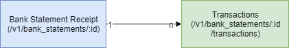

# Bank Statement API [](https://travis-ci.org/mariazevedo88/code-challenge)

## Description

The application consists of an API that returns data about bank transactions such as: id, amount, credit card number, currency, installments, creation date and update date. In short, the API follows the business model: A **bank statement receipt** is made up of multiple transactions during a period.



All **bank statements receipt** created can be retrieved from the API via the `GET /v1/bank_statements` route. If we want to see a specific **receipt**, we access the `GET /v1/bank_statements/:id` route (for example, in the `GET /v1/bank_statements/22` route we can see transaction details of `id=22` in the database). Therefore, we may have multiple transactions for a specific period in one bank statement, just as we may have multiple bank statements of various specific time intervals. If we want to see the list of **transactions** in a specific **receipt**, we access the `GET /v1/bank_statements/:id/transactions` route (for example, in the `GET /v1/bank_statements/22/transactions` route we can see all transactions of the receipt with `id=22`).

Additionally, you can create, update, and remove transactions from the database. The major API routes are shown below.


The Bank Statement API `GET /v1/bank_statements` route has as filter parameters:

- Number of days: You can filter bank transactions created by the number of days. For example, transactions created 3 days ago, 15 days ago, 30 days ago, etc ...
- Page: API searches are paginated.
- Size: Number of records per page fetched.

## Authentication

We use **Devise Token Auth** as a plugin to control user authentication in the API. Note: In the current version, authentication is disabled.

## Caching strategy

We use a combination of strategies to perform caching in the API:

- **Russian doll caching**: this type of caching is an extension of **Fragment Caching**. Used when you may want to nest cached fragments inside other cached fragments. For example, when any attribute of a transaction within a bank statement is changed, the cache is updated and when querying the modified statement, the requests will use that new cache. Let's follow the example of the bank statement `id=30`.


With `cache_key` updated, next request returns `304 (Not Modified)`.


As can be seen in the code below, the bank statement of `id=30` has three transactions performed on December, 1 of 2019, from id's: `48`, `49`, `50`.

```
{
    "data": [
        {
            "id": "48",
            "type": "transactions",
            "attributes": {
                "amount": "65.01",
                "credit-card": "5111-9234-6810-3484",
                "installments": 9,
                "created-at": "2019-12-01T16:29:21.288Z",
                "updated-at": "2019-12-01T16:29:21.288Z"
            },
            "relationships": {
                "bank-statement": {
                    "data": {
                        "id": "30",
                        "type": "bank-statements"
                    }
                }
            }
        },
        {
            "id": "49",
            "type": "transactions",
            "attributes": {
                "amount": "88.43",
                "credit-card": "4539022070604",
                "installments": 1,
                "created-at": "2019-12-01T16:29:21.296Z",
                "updated-at": "2019-12-01T16:29:21.298Z"
            },
            "relationships": {
                "bank-statement": {
                    "data": {
                        "id": "30",
                        "type": "bank-statements"
                    }
                }
            }
        },
        {
            "id": "50",
            "type": "transactions",
            "attributes": {
                "amount": "48.53",
                "credit-card": "5415-8006-4532-4006",
                "installments": 8,
                "created-at": "2019-12-01T16:29:21.304Z",
                "updated-at": "2019-12-01T16:29:21.307Z"
            },
            "relationships": {
                "bank-statement": {
                    "data": {
                        "id": "30",
                        "type": "bank-statements"
                    }
                }
            }
        }
    ]
}
```

We will update the transaction `id=48`, changing the `amount` to `65.00`.


When you not using this strategy, a cached element will expire if the value of `updated_at` changes for a record on which the cached file directly depends. In other words, since the cache of the transaction `id=48` within the `id=30` bank statement has been updated, by querying that same statement, the query will return `200` and no longer `304`.

 

To make the application behave with the Russian doll's strategy, explained below, we tie the models together with the `touch` method, as below example:

```
class Transaction < ApplicationRecord
    belongs_to :bank_statement, touch: true, optional: true

    # Code here...
end
```

- **Conditional cache headers**: are a feature of the HTTP specification that provide a way for web servers to tell browsers that the response to a GET request hasn't changed since the last request and can be safely pulled from the browser cache. They work by using the `HTTP_IF_MODIFIED_SINCE` header to pass back and forth both a unique content identifier and the timestamp of when the content was last changed. If the browser makes a request where the last modified since timestamp matches the server's version then the server only needs to send back an empty response with a not modified status.

- **Memcache**: used in production mode. Memcached is an open-source application caching service. To prepare the Bank Statement requests to perform memcache, we used `Rails.cache` function. In the `index` request, the `Rails.cache.fetch` method takes a key argument and a block. If the key is present, then the corresponding value is returned. If not, the block is executed and the value is stored with the given key, then returned.

It is used the `dalli` gem as a memcache client library, and memcachier.

This combination of strategies has been chosen for better performance, better management of the information demonstrated in the API and assurance of data integrity.

## API documentation

The full API documentation can be found at this [link](API.md).

## Gems

The gems used in the project are listed below:

* **rails ~> 5.2.2** (Rails Framework)
* **rails-i18n ~> 5.1** (Collecting Locale data for Ruby on Rails I18n)
* **puma ~> 3.11** (App server)
* **pg ~> 1.1, >= 1.1.4** (A PostgreSQL client library for Ruby)
* **devise_token_auth** (Token based authentication for Rails JSON APIs)
* **versionist** (A plugin for versioning Rails based RESTful APIs)
* **bootsnap >= 1.1.0** (Reduces boot times through caching)
* **rack-cors** (Handling Cross-Origin Resource Sharing - CORS, making cross-origin AJAX possible)
* **active_model_serializers ~> 0.10.0** (ActiveModel::Serializer implementation and Rails hooks)
* **foreman** (Manage Procfile-based applications)
* **kaminari** (A Scope & Engine based, clean, powerful, customizable and sophisticated paginator for Ruby webapps)
* **rack-reducer** (Declaratively filter data via URL params, in any Rack app, with any ORM)
* **dalli** (High performance memcached client for Ruby)
* **travis** (CLI and Ruby client library for Travis CI)
* **byebug** (Plugin to stop execution and get a debugger console)
* **faker** (A library for generating fake data)
* **pry-rails** (Rails >= 3 pry initializer)
* **rspec-rails ~> 3.9.0** (RSpec for Rails-3+)

## Dependencies

To run the API in development environment, you need to have postgresql installed. Here is a [tutorial](https://www.digitalocean.com/community/tutorials/how-to-use-postgresql-with-your-ruby-on-rails-application-on-ubuntu-18-04) for installation.

## Build Setup

    # install dependencies
    bundle

    # creating a role in postgresdb for the application (on the postgres terminal)
    create role railsdb with createdb login password '123@456'

    # drop database
    rails db:drop

    # create database
    rails db:create

    # migrate database
    rails db:migrate
    
    # generate data
    rails dev:setup

## Running the application

    # run application
    foreman start

## Running unit tests

    # migrate database
    rails db:migrate RAILS_ENV=test

    # generate data
    rails dev:setup RAILS_ENV=test
    
    # tests application
    rspec

By default, the API is available in development/test mode on http://localhost:5000/v1/. In production environment: https://code-challenge-mari.herokuapp.com/v1/.

## Contributors

[](https://sourcerer.io/fame/mariazevedo88/mariazevedo88/code-challenge/links/0)[](https://sourcerer.io/fame/mariazevedo88/mariazevedo88/code-challenge/links/1)[](https://sourcerer.io/fame/mariazevedo88/mariazevedo88/code-challenge/links/2)[](https://sourcerer.io/fame/mariazevedo88/mariazevedo88/code-challenge/links/3)[](https://sourcerer.io/fame/mariazevedo88/mariazevedo88/code-challenge/links/4)[](https://sourcerer.io/fame/mariazevedo88/mariazevedo88/code-challenge/links/5)[](https://sourcerer.io/fame/mariazevedo88/mariazevedo88/code-challenge/links/6)[](https://sourcerer.io/fame/mariazevedo88/mariazevedo88/code-challenge/links/7)